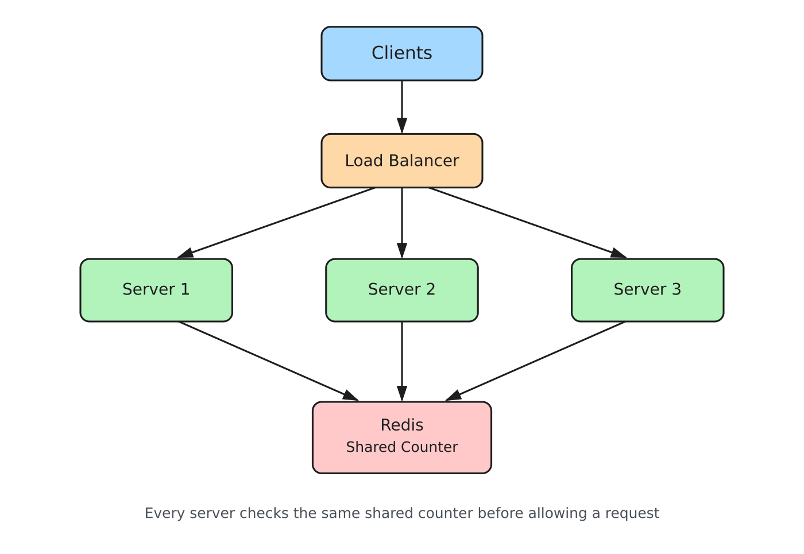
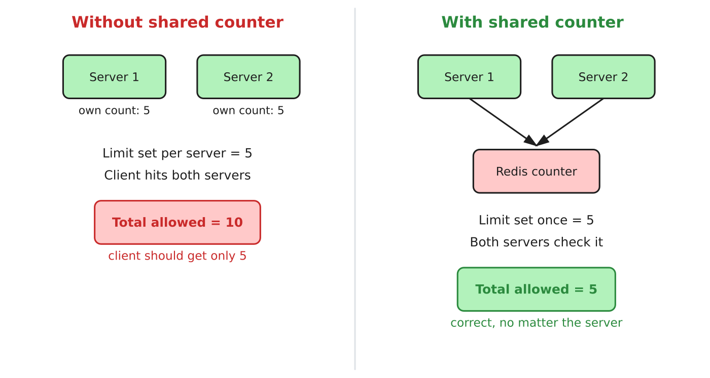
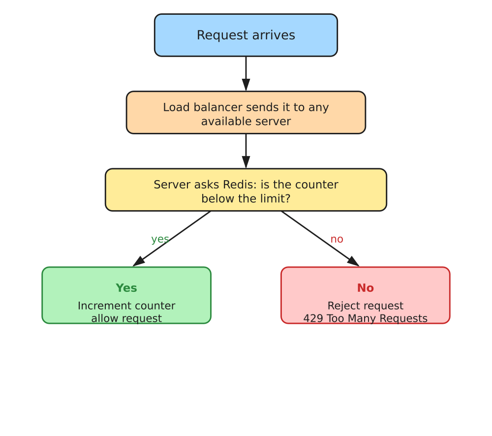
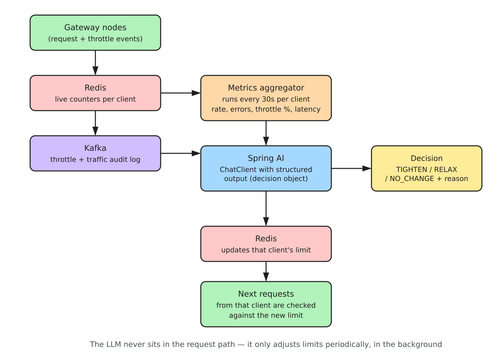

# DistriLimit

A distributed rate limiting gateway that enforces request limits correctly across multiple server instances, using a shared counter instead of per-server memory.

## Architecture



All servers sit behind a load balancer and share a single source of truth (Redis) for rate limit state. A request can land on any server, and the limit is still enforced correctly across the whole group.

## The problem

A single-instance rate limiter keeps its counter in local memory. This breaks as soon as there is more than one server, because each instance only knows about the requests it personally received.

Example, with a limit of 5 requests per client:

```
Client sends 10 requests
5 requests land on Server 1
5 requests land on Server 2

Server 1 counter: 0 -> 1 -> 2 -> 3 -> 4 -> 5   (allows all 5, thinks limit reached)
Server 2 counter: 0 -> 1 -> 2 -> 3 -> 4 -> 5   (allows all 5, thinks limit reached)

Total allowed = 10
Configured limit = 5
```

Each server is individually correct, but the system as a whole is not.

## The fix

Move the counter out of each server and into a single shared store (Redis). Every server checks and updates the same counter, using an atomic operation so two servers can never both read "4" and both increment to "5" at the same time.

```
Client sends 10 requests, spread across Server 1 and Server 2

Both servers check the same Redis counter before allowing a request

Request 1  -> counter 0 -> 1   allowed
Request 2  -> counter 1 -> 2   allowed
Request 3  -> counter 2 -> 3   allowed
Request 4  -> counter 3 -> 4   allowed
Request 5  -> counter 4 -> 5   allowed
Request 6  -> counter at 5     rejected
Request 7  -> counter at 5     rejected
...
Request 10 -> counter at 5     rejected

Total allowed = 5
Configured limit = 5
```

## Before vs after



## Request flow



## Token bucket, expressed mathematically

One of the algorithms this project implements is the token bucket. A bucket holds up to `B` tokens, refills at rate `r` tokens per second, and each request consumes 1 token.

```
tokens(t) = min(B, tokens(t - 1) + r * (t - (t - 1)))

request allowed only if tokens(t) >= 1
if allowed: tokens(t) = tokens(t) - 1
```

Example: bucket capacity `B = 5`, refill rate `r = 1` token/second, starting full.

```
t = 0s   tokens = 5   3 requests arrive   tokens = 5 -> 4 -> 3 -> 2   (all 3 allowed)
t = 1s   tokens = 2 + 1 = 3   2 requests arrive   tokens = 3 -> 2 -> 1   (both allowed)
t = 2s   tokens = 1 + 1 = 2   5 requests arrive   tokens = 2 -> 1 -> 0, then rejected  (2 allowed, 3 rejected)
```

This allows short bursts (using saved-up tokens) while keeping the average rate at `r` per second over time.

## Adaptive rate limiting with Spring AI

Fixed limits treat every client the same, which is not always correct. A client with a sudden but legitimate burst of traffic gets throttled the same way a bot or an abusive client would. This phase adds a background process that uses Spring AI to look at each client's recent behavior and adjust their limit accordingly, instead of leaving it fixed forever.



This runs independently of the request path. Every 30 seconds, per client, the aggregator pulls recent numbers already available in the system: request rate, error rate, throttle percentage, and latency. These are passed to a language model through Spring AI's `ChatClient`, using structured output so the response comes back as a typed object rather than free text.

```
Input to the model (per client, every 30s)

request_rate      = 42 requests/min
error_rate        = 2%
throttle_rate     = 18%
latency_p99       = 340ms
pattern           = steady increase over last 3 intervals
```

```
Output from the model (structured, not free text)

{
  "action": "RELAX",
  "newLimit": 60,
  "reason": "Traffic is rising steadily with a low error rate and no
             signs of abuse, current limit is likely too strict"
}
```

The decision then updates that client's limit in Redis, and every request after that point is checked against the new value. The model is never called on the request path itself, so it never adds latency to an actual API call, it only adjusts the limit in the background.

This turns the rate limiter from a fixed rulebook into something that reasons about traffic patterns, while keeping the actual request handling path just as fast as before.

## Diagram source files

The `diagrams` folder also contains the original `.excalidraw` scene file. Open it at excalidraw.com to view or edit.

## Status

Core shared-counter version in progress. Additional algorithms, async audit logging, and the Spring AI adaptive limiting phase planned next.
